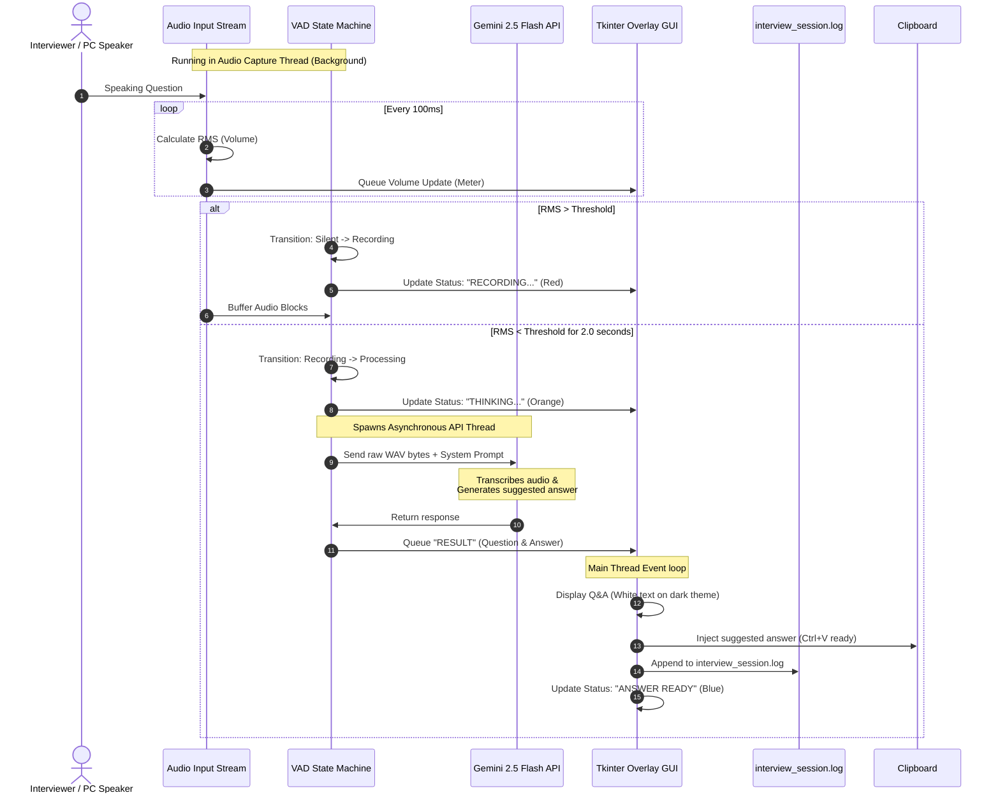

# 🎤 AI Interview Copilot

An invisible-to-capture, real-time AI interview copilot designed to listen to live job interviews, transcribe questions, and generate suggested answers instantly. 

It provides a transparent overlay window on your screen that is visible to you, but completely invisible to screenshots and screen-sharing systems (like Zoom, Microsoft Teams, Google Meet, Discord, and OBS).

---

## 🏗️ Architecture & Background Workflow

The application runs multi-threaded processes to capture audio, evaluate voice activation thresholds, communicate with Gemini 2.5 Flash, and render a protected user interface.

### Background Data Flow


### Voice Activity Detection (VAD) State Transitions
```mermaid
stateDiagram-v2
    [*] --> SILENT: Start App (State: LISTENING)
    
    SILENT --> RECORDING: RMS > Threshold
    note on entry: Clear audio buffer, start buffering
    
    RECORDING --> SILENCE_WAIT: RMS < Threshold
    note on entry: Start silence timer
    
    SILENCE_WAIT --> RECORDING: RMS > Threshold
    note on entry: Resume buffering (false pause)
    
    SILENCE_WAIT --> PROCESSING: Silence Timer >= 2.0s
    note on entry: Stop buffering, export WAV, spawn Gemini thread
    
    PROCESSING --> SILENT: API Done / Return Status
```

---

## ✨ Features

- **🛡️ Screenshot & Screen-Share Protection**: Uses the Windows display affinity API (`SetWindowDisplayAffinity`) to ensure the window is entirely hidden from Zoom, Teams, Meet, OBS, and screenshots.
- **⚡ Multimodal Audio-to-Answer**: Sends raw audio bytes directly to the Gemini 2.5 Flash API. This processes transcription and answer generation in a single step for ultra-low latency and higher accuracy.
- **📋 Automatic Clipboard Copy**: Copies suggested answers to your clipboard immediately upon generation. Simply press `Ctrl + V` to paste.
- **💾 Session Persistence**: Automatically appends all questions and answers in real-time to a local file (`interview_session.log`) as a permanent back-up.
- **📥 Transcript Exporter**: An export button `[Save]` in the UI allows you to export formatted, timestamped transcripts to a `.txt` file of your choice.
- **🔍 Real-Time Volume Meter**: A live volume bar visualizer on the control bar helps you calibrate the voice threshold.
- **🎛️ Size & Font Controls**: Toggle "Compact Mode" to reduce the overlay to a tiny status bar, or adjust text font size dynamically with `A+`/`A-` buttons.

---

## 🛠️ Installation & Setup

1. **Clone the repository**:
   ```bash
   git clone https://github.com/pulkitmalik099-ctrl/Interview-Assistant.git
   cd Interview-Assistant
   ```

2. **Create and Activate Python Virtual Environment**:
   ```powershell
   python -m venv venv
   .\venv\Scripts\activate
   ```

3. **Install Dependencies**:
   ```powershell
   pip install -r requirements.txt
   ```

4. **Configure your environment variables**:
   Create a `.env` file from the template (or copy `.env.example` to `.env`) and add your Gemini API Key:
   ```ini
   GEMINI_API_KEY=AIzaSyYourGeminiApiKeyHere
   AUDIO_THRESHOLD=0.015
   SILENCE_DURATION=2.0
   AUDIO_DEVICE_ID=None
   ```
   *(You can obtain a free Gemini API key from [Google AI Studio](https://aistudio.google.com/))*

---

## 🎤 Audio Source Configuration

### 1. Speaker/Phone Mode (Default Microphone)
If you are running the interview on a secondary device (like your phone on speakerphone) or using your laptop microphone to capture surrounding audio, run the app with default settings:
```powershell
python interview_assistant.py
```

### 2. PC Audio Mode (Zoom/Meet Loopback)
To capture audio directly coming from speakers (e.g., a Zoom call or web call on the same computer):
1. Run the device list utility:
   ```powershell
   python interview_assistant.py --list-devices
   ```
2. Locate the device ID corresponding to your system loopback output, typically named **Stereo Mix** or **WASAPI Loopback**.
3. Set the `AUDIO_DEVICE_ID` in your `.env` file to that ID (e.g. `12`):
   ```ini
   AUDIO_DEVICE_ID=12
   ```

---

## 🎮 Interface Controls

- **Drag window**: Click and hold the header bar `🎤 INTERVIEW COPILOT` to drag the window anywhere on your screen.
- **✕ Button**: Close the program and close all audio threads.
- **⛶ Button**: Toggle compact mode. Reduces the overlay to a 160x40 widget showing only the live status bulb and volume bar.
- **A- / A+ Buttons**: Adjust text size for readability.
- **Clear Button**: Reset screen text.
- **Save Button**: Export formatted session logs to a new `.txt` file.

---

## 🛡️ Verifying Screen-Share Protection

To verify that the window is completely invisible to screen sharing and recording:
1. Run the copilot:
   ```powershell
   python interview_assistant.py
   ```
2. Take a Windows screenshot (`Win + Shift + S`) or open Zoom/Google Meet and share your screen.
3. Review the screenshot or screen share. You will notice that **the Copilot window is entirely invisible** and does not appear on screen shares, though it is fully visible and usable on your physical monitor!
